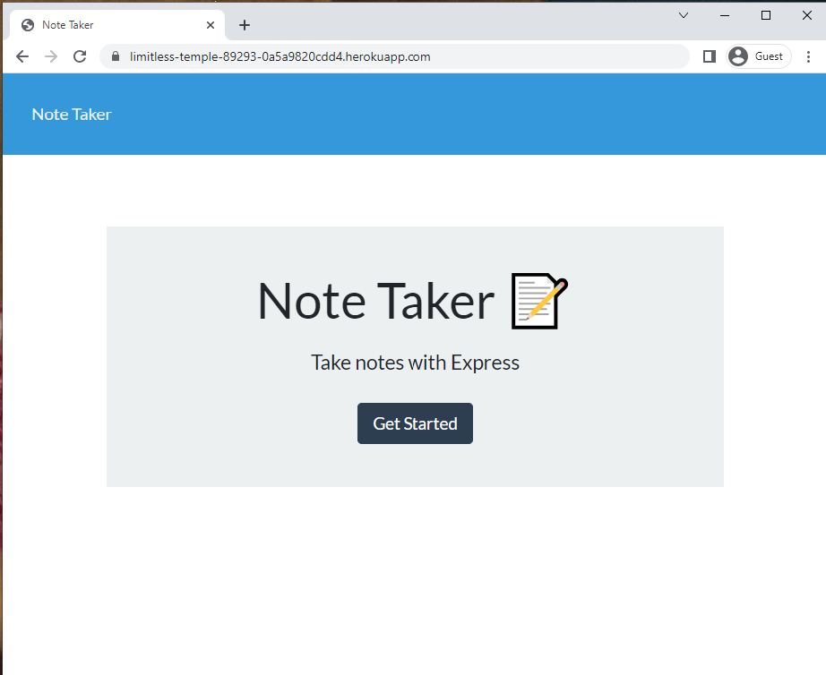
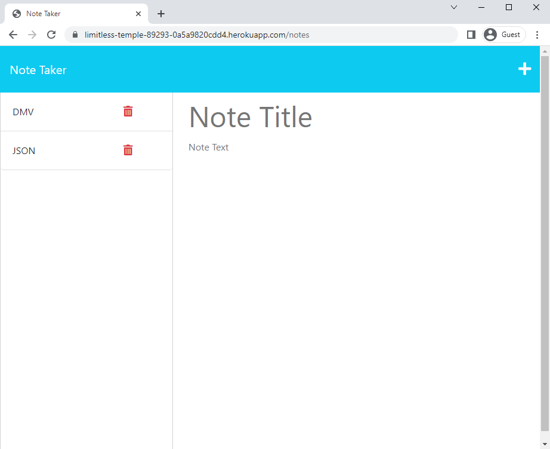

# Express Note Taker

<a href="https://afrozez.github.io/express-note-taker/"> Link to deployed GitHub application: https://afrozez.github.io/express-note-taker/</a>

<a href="https://limitless-temple-89293-0a5a9820cdd4.herokuapp.com/"> Link to live heroku server application: https://limitless-temple-89293-0a5a9820cdd4.herokuapp.com/</a>

## Description

This project can be used to write and save notes. This application will use an Express.js back end and will save and retrieve note data from a JSON file.

## Table of Contents

- [Express Note Taker](#express-note-taker)
  - [Description](#description)
  - [Table of Contents](#table-of-contents)
  - [Installation](#installation)
  - [Usage](#usage)
  - [Contribution Guidelines](#contribution-guidelines)
  - [Test Instructions](#test-instructions)
  - [License](#license)
  - [Questions](#questions)

## Installation

To run this program it is recommended to use the latest version of the chrome browser.

## Usage

To use this project, first you have to click the "Get Started" button on the landing page. The next step would be to click on the text that says "Note Title" and create a title for your note, you'll also need to click the "Note Text" underneath and enter your note. Once you've filled out the note title and note text a save icon will appear in the top right, click it to save the note into a JSON file. Your new note should then be saved and display the title on the left side of the browswer.

## Contribution Guidelines

If you'd like to contribute to this project in any way please pull the files from my GitHub repository and please add my name to the list of contributers inside of the README file.

## Test Instructions

N/a

## License

This application is covered under: Apache License 2.0

## Questions

If anyone has a question to ask they can reach me via email: [LukeADenHartog@gmail.com](mailto:LukeADenHartog@gmail.com).
My GitHub username is: Afrozez <https://github.com/Afrozez/>
